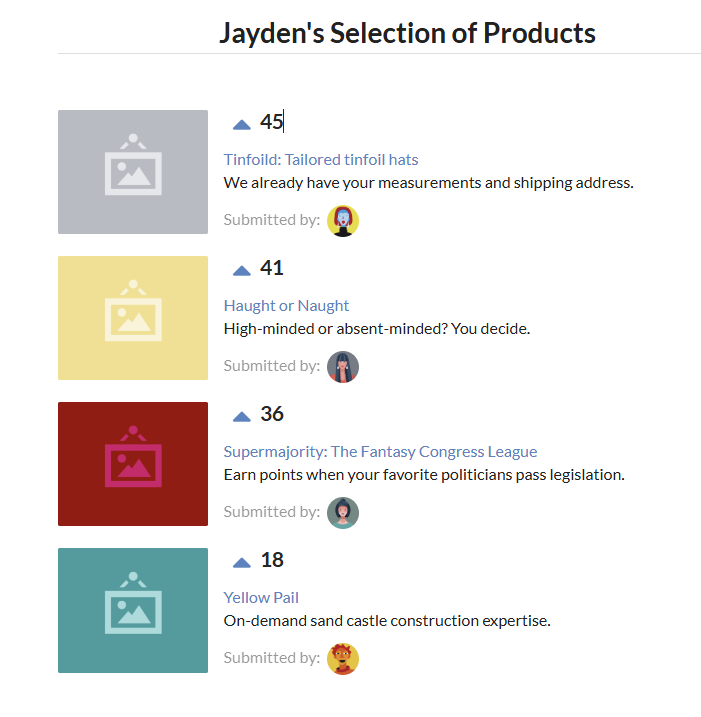

# Jayden's Selection of Products 

An app that has a list of product links that users can vote on. 

## Runtime Instructions

1. Clone this repository to your local machine.
2. Navigate to the project directory in your terminal.
3. Run `npm install` to install dependencies.
4. Start the development server with `npm start`.
5. Open your browser and visit `http://localhost:3000` to view the app.

## Screenshot

